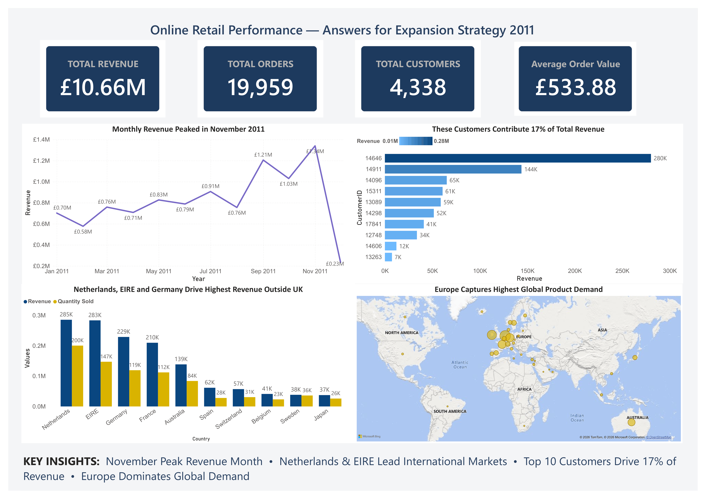
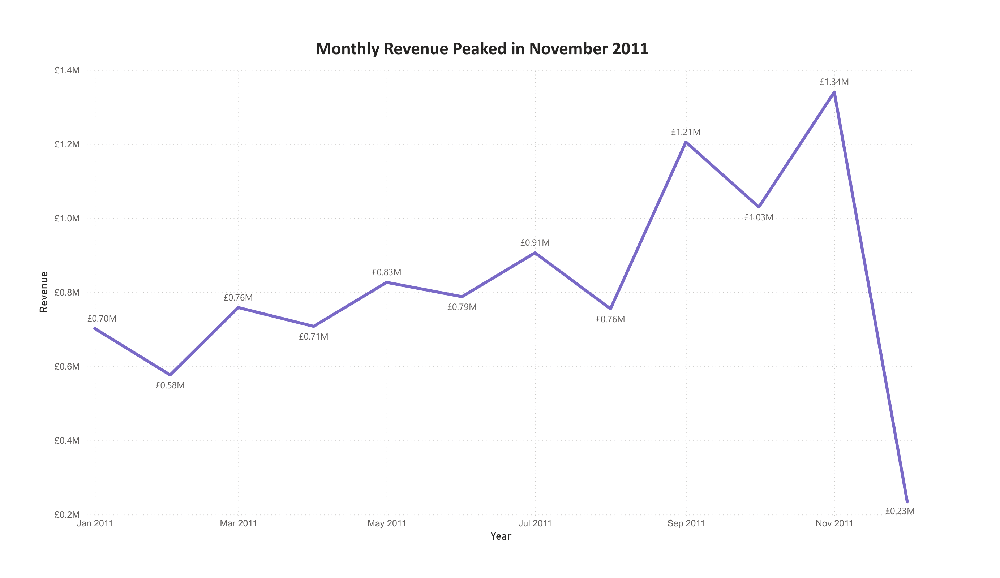
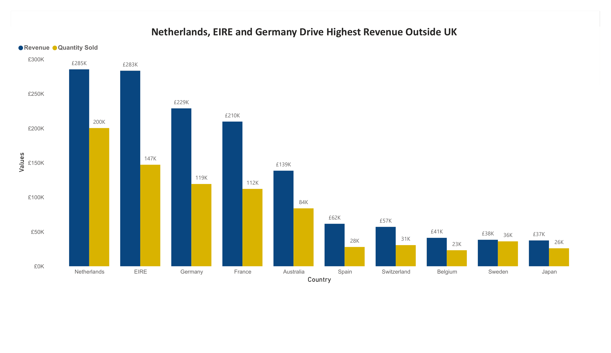
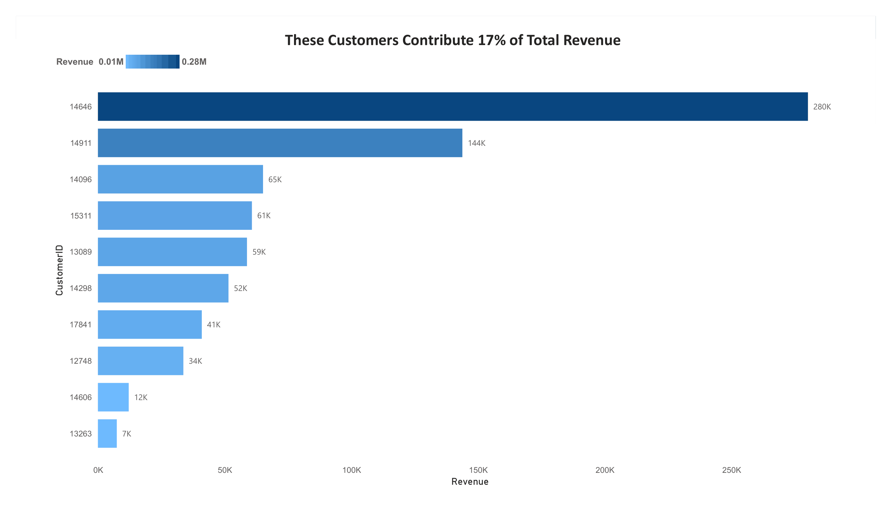
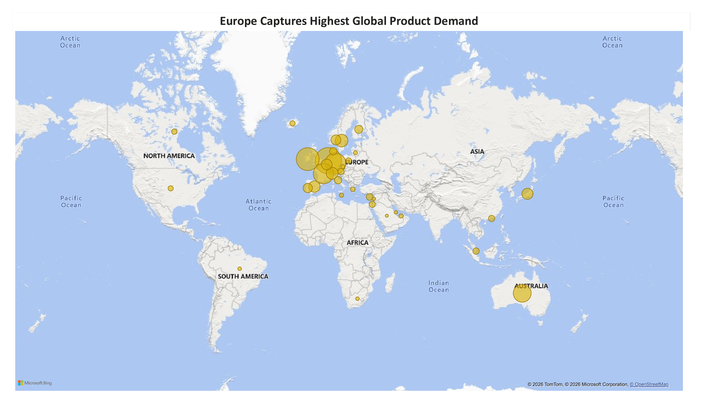

# Tata Data Visualisation — Forage Virtual Internship

Completed Tata's Data Visualisation virtual internship program. Analyzed 154,000+ rows of UK online retail transaction data to answer real business questions from a CEO and CMO perspective, supporting an expansion strategy decision.

## What I Did

Cleaned, modeled, and visualized a year of retail transaction data using Python and Power BI — then built an executive dashboard that answers four specific business questions in a single view.

## Process

**Cleaned the data in Python (Pandas)**
- Loaded 154,103 raw transaction rows
- Removed orders with quantity below 1 (product returns)
- Removed transactions priced at zero (data entry errors)
- Fixed a date parsing bug — corrected day-first date format (UK convention) that was silently misreading December orders as September
- Stripped cancelled invoices (prefix "A")
- Calculated Revenue as Quantity × UnitPrice
- Exported 150,316 clean rows ready for analysis

**Built four visuals in Power BI**
- Designed a monthly revenue trend line chart to surface seasonal demand
- Built a ranked bar chart comparing top 10 countries by revenue and volume, excluding the UK
- Created a gradient-ranked bar chart identifying the top 10 customers by revenue contribution
- Mapped global product demand using bubble sizing by quantity sold, excluding the UK

**Assembled an executive summary dashboard**
- Combined all four visuals with KPI cards (Total Revenue, Orders, Customers, Average Order Value) on one page
- Wrote insight-driven chart titles instead of generic labels — each title states a finding, not just a metric
- Diagnosed and fixed a cross-page filter bug that was silently restricting KPI totals to 2011-only data
- Added a key-insights footer summarizing all four findings in one line

## Key Findings

**Revenue peaks in November.** Monthly revenue climbed through the year and spiked hardest in November — the clearest pre-holiday demand signal in the dataset. Recommend building inventory and marketing spend from October onward to capture this pattern next cycle.

**Netherlands and EIRE lead international revenue.** Outside the UK, these two markets generated £285K and £283K respectively — well ahead of Germany and France. They're the strongest candidates for expansion investment.

**Ten customers drive 17% of total revenue.** Customer 14646 alone contributes £280K. Losing any of these ten customers would create a measurable revenue gap — they warrant a dedicated retention strategy.

**Europe dominates global demand**, with Australia and Japan showing the next-strongest signals outside the continent — flagging them as lower-competition expansion targets.

## Dashboard

## Individual Visuals

**Monthly Revenue Trend — 2011**

**Top 10 Countries by Revenue (Excluding UK)**

**Top 10 Customers by Revenue**

**Global Product Demand**

## Tools
Python (Pandas) for data cleaning · Power BI for modeling and visualization

## Files

| File | Description |
|---|---|
| `data_cleaning.ipynb` | Full Python cleaning pipeline |
| `clean_retail_data.zip` | Cleaned transaction-level data |
| `customer_data.zip` | Cleaned customer-level data (CustomerID) |
| `Tata_Retail_Data_Visualisation.pbix` | Power BI dashboard file |
| `/screenshots` | Exported images of all visuals + executive summary |

## Certificate

(https://www.theforage.com/completion-certificates/ifobHAoMjQs9s6bKS/MyXvBcppsW2FkNYCX_ifobHAoMjQs9s6bKS_6a18506e8e5fb2f1028a87e3_1782021553333_completion_certificate.pdf)
